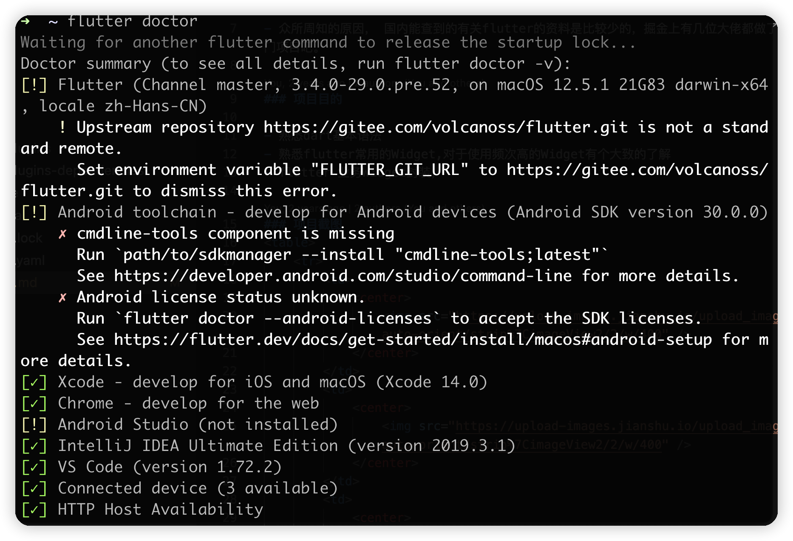
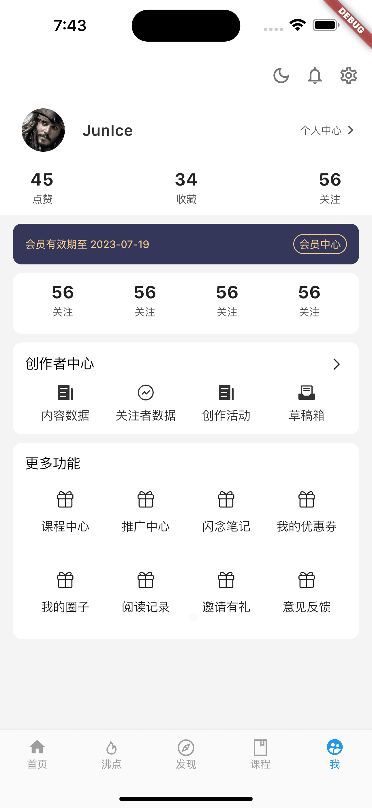
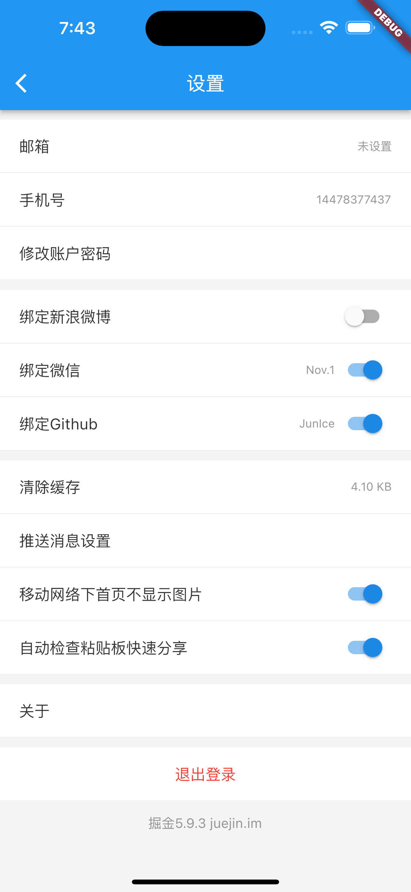
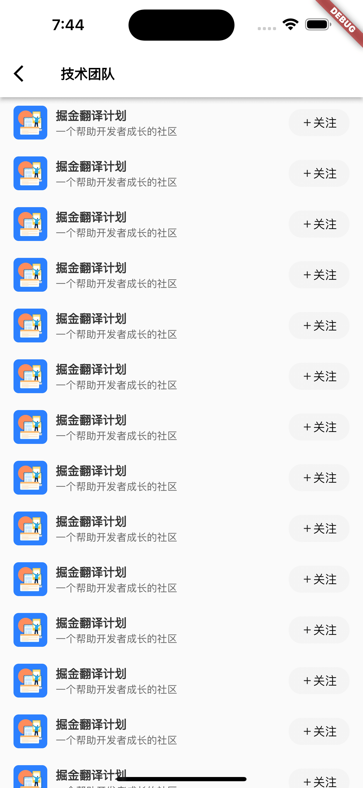

# flutter 基于掘金 App 实现的 UI 页面

### 基础 SDK

### 项目启动

- 掘金 App 作为入门项目DEMO

### 项目目的

- 熟悉 dart 基本语法
- 熟悉 flutter 常用的 Widget,对于使用频次高的 Widget 有个大致的了解
- flutter 业务 Widget 封装，

### 项目截图

<table>
    <tr>
        <td>
            

                
            

        </td>
        <td>
            

                
            

        </td>
        <td>
            

                
            

        </td>
    </tr>
    <tr>
        <td>
            

                
            

        </td>
        <td>
            

                
            

        </td>
        <td>
            

                
            

        </td>
    </tr>
</table>

### 遗留问题

- 掘金 app 中向下滚动隐藏 appBar,向上滚动显示 appBar 的动画未实现
- 个人中心 appBar 滚动的效果实现
- 没有实现 mock 数据，没有实现列表加载效果
- 项目都是静态页面，没有请求接口
- 未做状态管理
